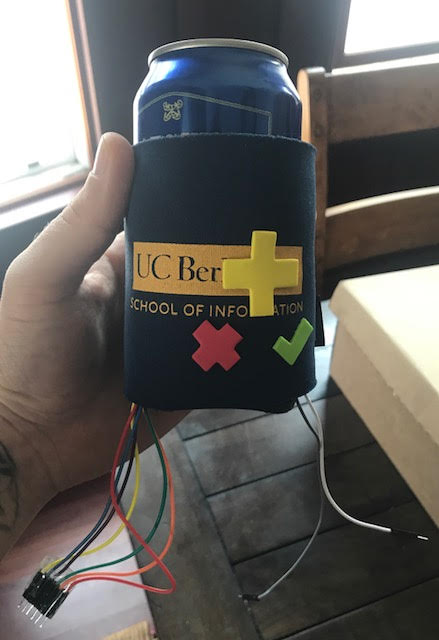
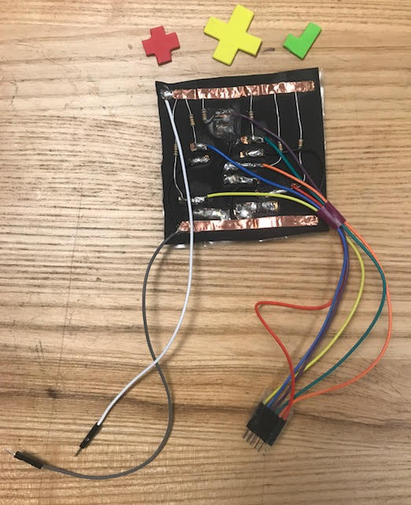
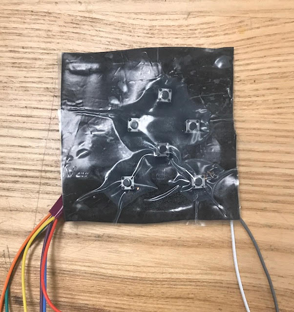
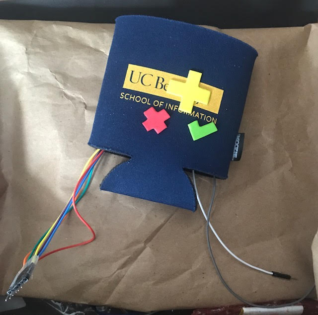

Coozy DPad by Steve Trush
=====================================

Have you ever wanted to change the channel or play a video game without putting down your beer? Now you can! 
Introducing the Coozy DPad - here is a demo:  
https://www.youtube.com/watch?v=S0Ccens-_vA

This is a text entry-device designed for Interactive Device Design (Fall 2017) at UC Berkeley. This initial prototype demonstrates how a device could be used to input text using a "classic video game"-like alphabet display. My imagined final version of this device would not be wired!

<b>The text entry technique I chose and why:</b> 
Wanting to allow the user to use a single hand to enter text, I originally used a multi-tap (think the typical 3-letters-per-key layout for feature phones) text-entry technique; however, once I considered the physical dimension of the form, I decided to simplify the layout to a directional pad with a button to select and a button to delete. This simplified layout would minimize the amount of finger dexterity needed to select the individual buttons and also lessen the focus of attention on the device. While a multi-tap layout may be faster for spelling out a word using a standard cell phone, users holding a typical 12-oz aluminum can will dedicate a higher amount of pressure for gripping their fingers around the can - this distribution of grip can limit the ability to find and press buttons in quick succession. By using a the D-Pad layout with big buttons, the user can confidently manipulate the device while confirming visually on the display which letter is being selected. Finally, this technique can also translate to navigating TV menus and to indicate directions during video games - two additional use cases.

<b>How I implemented character recognition (i.e., how my code works):</b>
This implementation relies on display logic to inform the user which letter is currently selected. For the view, I created a custom RelativeLayout that displays three alphabetical rows of letters are displayed, the resulting message, and a transparent rectangle that shows the user which character is highlighted (see AlphabetSelectorView.java). The combined model/controller (see DPadApp.java) uses EdgeTriggers on 6 GPIO pins to catch button presses, using pull-up resistors, the tactile switches are read as pressed when the pin reads as LOW. The button presses are debounced by checking if the current time exceeds a threshold of 100 milliseconds since the previous reading. The model uses a matrix of characters and simply keeps track of both the row and column currently highlighted. Once the user uses the "Enter" button, the displayed message is updated with the currently highlighted key. In case of mistakes, the user is given the ability to delete characters. To increase typing speed, the rows and columns will wrap (eg. pressing right at the end of a letter row will return the user back to the beginning of that row).

<b>How you constructed the physical device:</b>
First, I breadboarded the circuits, connecting six momentary tactile switches to pull-up resistors and 6 digital GPIO pins, as shown here:  
  Here's a schematic view of the circuit: 
 
Getting the switches to work with the display was the easy part, the challenges of a specific coozy (Koozie) form factor had to be considered. Particularly, coozies are typically used on cold cans that may be wet, due to being pulled from an ice chest and condensation forming on the outside of the can. Beyond possible contact with water, the conductive metal of the can itself could cause a short circuit if parts of the device circuit contacted the can directly. Finally, the actuated buttons and mount would need to be flexible to conform to different circumference containers and provide the user with a smooth surface to hold. 

To achieve a flexible mount, I used a thin rubber foam backing to mount the switches. I then used copper tape as a base to solder together the 10kOhm resistors, switches, wire connections. For waterproofing, I used a moisture-resistant epoxy (Amazing Goop II) to seal the circuitry. Notably, I used a multimeter to ensure zero conductivity of the epoxy prior to sealing the device and, even then, tested the epoxy over on connected switch to ensure that it would function as intended.

On the front of the device, instead of using epoxy (I didn't want to the buttons to stick!), I glued a plastic covering over the front of the mount. This plastic front could then be glued inside of the coozy and foam sticker buttons could be affixed to the front of the coozy. However, once a full can of beer was place in the coozy, the amount of pressure on the switches caused them to be unintentionally "pressed". To relieve the amount of pressure, I removed the foam stickers, took a scoring knife and made small incisions through the coozy material directly over the switches. This removed the tension from over the buttons and the device functioned as intended. 

A photo of the back of the device before final waterproofing (notice the UP button is covered in epoxy): 
 

A photo of the front of the switch mount: 
 

A photo of the completed device without a tasty beverage: 
 

<b>Reflection:</b>  
As someone who had never soldered an electronic device together before, I learned quite a bit through this assignment. Fundamentals of building electrical circuits (for instance, learning how digital switches worked or the difference between pull-up and pull-down resisters) was facilitated through this assignment, but while I found actually building the breadboard circuit fairly simple (granted it is a simple 6-switch design), I learned how, upon considering various form factors, the construction of the physical device can quickly become complicated. 

<b>Demo video:</b> https://www.youtube.com/watch?v=S0Ccens-_vA

License
-------

Copyright 2016 The Android Open Source Project, Inc.

Licensed to the Apache Software Foundation (ASF) under one or more contributor
license agreements.  See the NOTICE file distributed with this work for
additional information regarding copyright ownership.  The ASF licenses this
file to you under the Apache License, Version 2.0 (the "License"); you may not
use this file except in compliance with the License.  You may obtain a copy of
the License at

  http://www.apache.org/licenses/LICENSE-2.0

Unless required by applicable law or agreed to in writing, software
distributed under the License is distributed on an "AS IS" BASIS, WITHOUT
WARRANTIES OR CONDITIONS OF ANY KIND, either express or implied.  See the
License for the specific language governing permissions and limitations under
the License.
