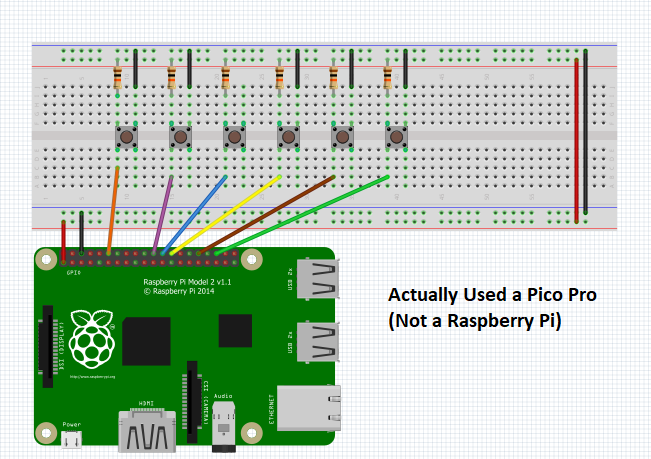
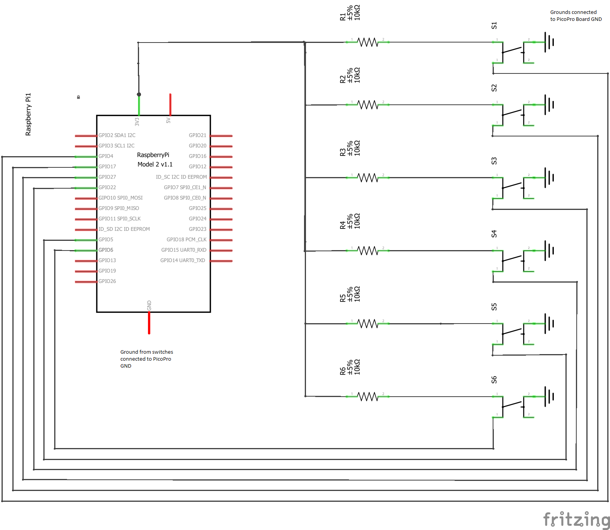

Coozy DPad by Steve Trush
=====================================

Have you ever wanted to change the channel or play a video game without putting down your beer? Now you can! 
Introducing the Coozy DPad - here is a demo:  
https://www.youtube.com/watch?v=S0Ccens-_vA

This is a text entry-device designed for Interactive Device Design (Fall 2017) at UC Berkeley. This initial prototype demonstrates how a device could be used to input text using a "classic video game"-like alphabet display. My imagined final version of this device would not be wired!

<b>The text entry technique I chose and why:</b> 
Wanting to allow the user to use a single hand to enter text, I originally used a multi-tap (think the typical 3-letters-per-key layout for feature phones) text-entry technique; however, once I considered the physical dimension of the form, I decided to simplify the layout to a directional pad with a button to select and a button to delete. This simplified layout would minimize the amount of finger dexterity needed to select the individual buttons and also lessen the focus of attention on the device. While a multi-tap layout may be faster for spelling out a word using a standard cell phone, users holding a typical 12-oz aluminum can will dedicate a higher amount of pressure for gripping their fingers around the can - this distribution of grip can limit the ability to find and press buttons in quick succession. By using a the D-Pad layout with big buttons, the user can confidently manipulate the device while confirming visually on the display which letter is being selected. Finally, this technique can also translate to navigating TV menus and to indicate directions during video games - two additional use cases.

<b>How I implemented character recognition (i.e., how my code works):</b>
This implementation relies on display logic to inform the user which letter is currently selected. For the view, I created a custom RelativeLayout that displays three alphabetical rows of letters are displayed, the resulting message, and a transparent rectangle that shows the user which character is highlighted (see AlphabetSelectorView.java). The combined model/controller (see DPadApp.java) uses EdgeTriggers on 6 GPIO pins to catch button presses, using pull-up resistors, the tactile switches are read as pressed when the pin reads as LOW. The button presses are debounced by checking if the current time exceeds a threshold of 100 milliseconds since the previous reading. The model uses a matrix of characters and simply keeps track of both the row and column currently highlighted. Once the user uses the "Enter" button, the displayed message is updated with the currently highlighted key. In case of mistakes, the user is given the ability to delete characters. To increase typing speed, the rows and columns will wrap (eg. pressing right at the end of a letter row will return the user back to the beginning of that row).

<b>How you constructed the physical device:</b>
First, I breadboarded the circuits, connecting six momentary tactile switches to pull-up resistors and 6 digital GPIO pins.

<b>Images:</b> 
A photo of the final device you constructed:

<b>Wiring diagram:</b> 
Breadboard 
 
Schematic 

<b>Reflection:</b>  
I learned quite a bit through this assignment. Even though I had soldered wires before (mostly in building radio antennas), this was my first time building an actual electronic device. While I found actually building the breadboard circuit fairly simple (granted it is a simple 6-switch design with pull-up resisters), I saw how, upon considering various form factors, the construction of the physical device can quickly become complicated. 

<b>Demo video:</b> https://www.youtube.com/watch?v=S0Ccens-_vA

License
-------

Copyright 2016 The Android Open Source Project, Inc.

Licensed to the Apache Software Foundation (ASF) under one or more contributor
license agreements.  See the NOTICE file distributed with this work for
additional information regarding copyright ownership.  The ASF licenses this
file to you under the Apache License, Version 2.0 (the "License"); you may not
use this file except in compliance with the License.  You may obtain a copy of
the License at

  http://www.apache.org/licenses/LICENSE-2.0

Unless required by applicable law or agreed to in writing, software
distributed under the License is distributed on an "AS IS" BASIS, WITHOUT
WARRANTIES OR CONDITIONS OF ANY KIND, either express or implied.  See the
License for the specific language governing permissions and limitations under
the License.
